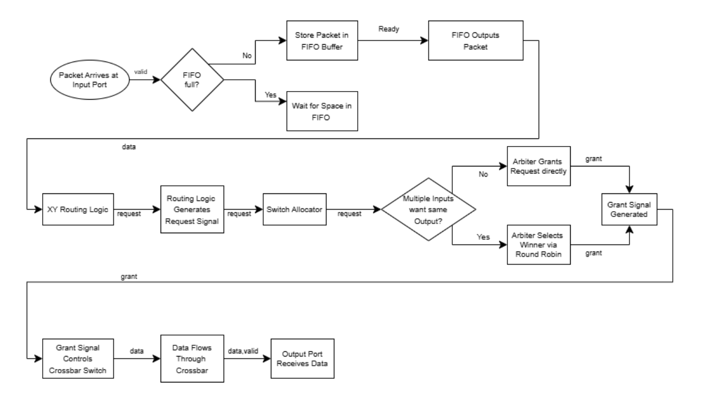
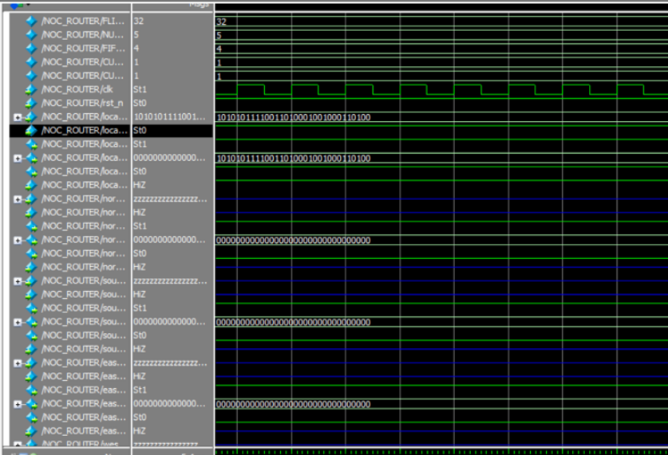
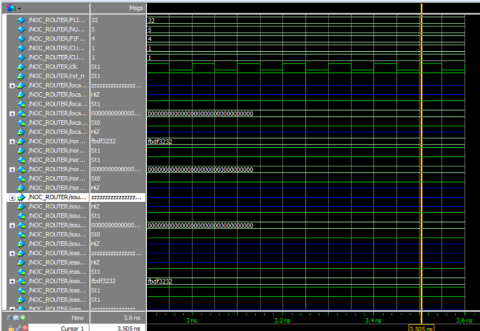
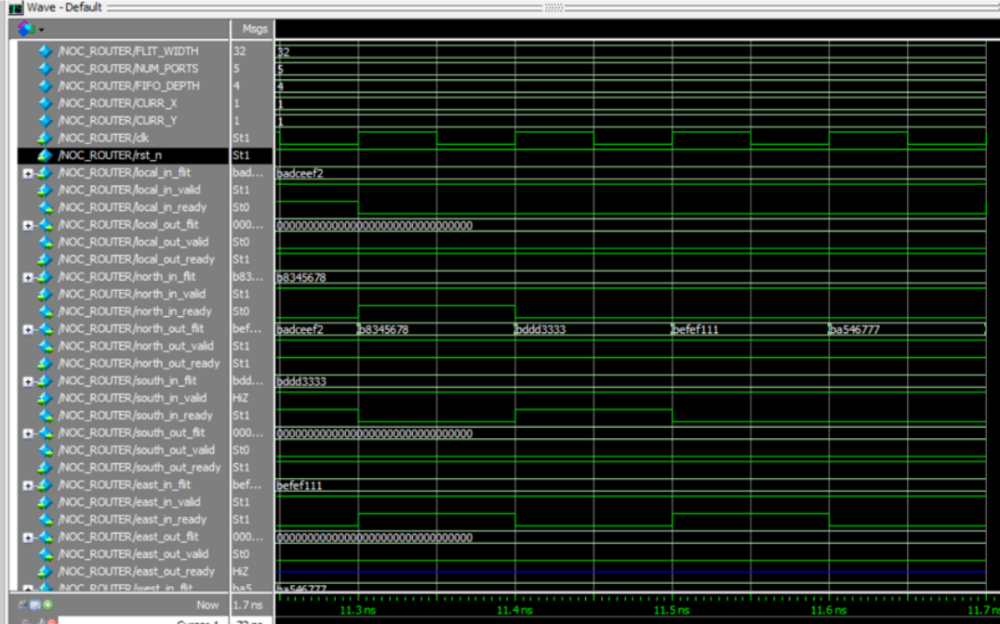
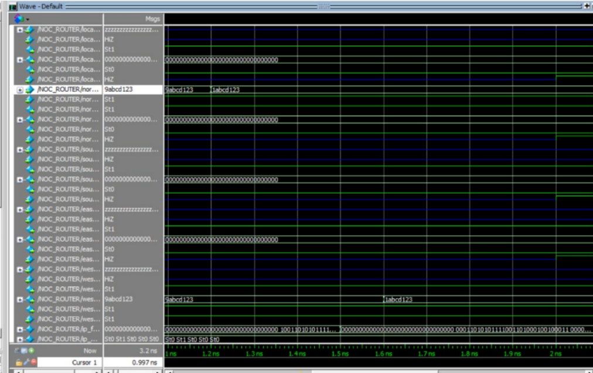
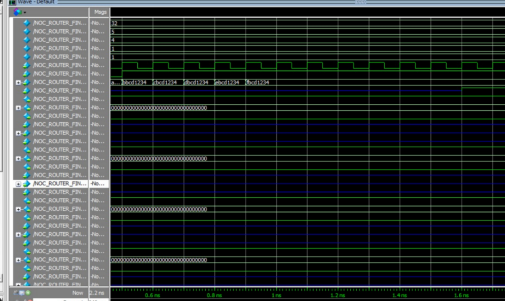

# Network-on-Chip (NoC) Router using Verilog

## Overview

This project presents the design and implementation of a 5-port Wormhole Network-on-Chip (NoC) Router using Verilog HDL.

The router is designed for scalable on-chip communication in modern multi-core processors and System-on-Chip (SoC) architectures. It implements deterministic XY Routing, Round-Robin Arbitration, FIFO-based buffering, Backpressure Flow Control, and a 5×5 Crossbar Switch for efficient packet transmission.

An interactive GUI visualizer was also developed to demonstrate real-time packet flow, routing decisions, arbitration, and congestion handling in a mesh-based NoC environment.

## Features

- 5-Port NoC Router Architecture
- Wormhole Switching
- Deterministic XY Routing Algorithm
- Round-Robin Arbitration
- Input FIFO Buffers
- Backpressure Flow Control
- 5×5 Crossbar Switch
- Multi-Port Contention Handling
- Deadlock-Free Routing
- GUI-Based Packet Flow Visualization
- Simulation-Based Verification

## Router Architecture

## Design Flow

The router processes packets through the following stages:

1. Packet Arrival
2. FIFO Buffering
3. Header Flit Processing
4. XY Routing Decision
5. Switch Allocation
6. Round-Robin Arbitration
7. Crossbar Switching
8. Output Transmission

## Key Components

### Input FIFO Buffer

- Stores incoming packets
- Prevents data loss
- Supports backpressure mechanism
- Generates Full and Empty status signals

### XY Routing Logic

The destination coordinates are decoded from the packet header and routed according to the XY Routing algorithm.

| Condition | Direction |
|------------|------------|
| Dest X > Current X | East |
| Dest X < Current X | West |
| Dest X = Current X & Dest Y > Current Y | North |
| Dest X = Current X & Dest Y < Current Y | South |
| Dest X = Current X & Dest Y = Current Y | Local |

### Round-Robin Arbiter

- Resolves output port contention
- Ensures fairness among requesting ports
- Rotates priority after every grant

### 5×5 Crossbar Switch

- Connects any input port to any output port
- Supports multiple simultaneous transfers
- Reconfigures dynamically every clock cycle

## Simulation Results

### Case 1 – Local Input to Local Output

Verifies correct local packet delivery.

### Case 2 – North to East Routing

Verifies XY routing functionality.

### Case 3 – Multiple Inputs to Same Output

Verifies Round-Robin Arbitration.

### Case 4 – Header and Body Flit Handling

Verifies routing with and without header flits.

### Case 5 – FIFO Backpressure

Verifies congestion handling and flow control.

## Applications

- Multi-Core Processors
- System-on-Chip (SoC) Designs
- AI/ML Accelerators
- GPU Interconnects
- Chiplet Architectures
- Neuromorphic Computing
- Processing-In-Memory (PIM)
- Quantum-Classical Interface Chips

## Author

Dharmi Patel

B.Tech Electronics & Communication Engineering  
Nirma University, Gujarat
